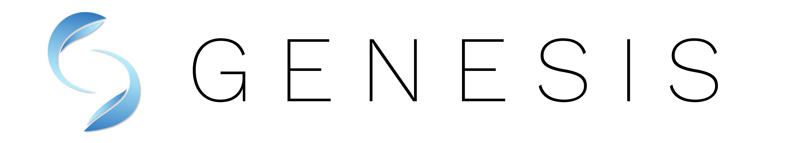

[](https://pypi.org/project/genesis-world/)
[](https://pypi.org/project/genesis-world/)
[](https://github.com/Genesis-Embodied-AI/Genesis/issues)
[](https://github.com/Genesis-Embodied-AI/Genesis/discussions)
[](https://discord.gg/nukCuhB47p)
<a href="https://drive.google.com/uc?export=view&id=1ZS9nnbQ-t1IwkzJlENBYqYIIOOZhXuBZ"></a>

[](./README.md)
[](./README_FR.md)
[](./README_KR.md)
[](./README_CN.md)
[](./README_JA.md)

# Genesis

## 🔥 最新情報

  - [2025-08-05] v0.3.0をリリースしました 🎊 🎉
  - [2025-07-02] Genesisの開発が、[Genesis AI](https://genesis-ai.company/)によって公式にサポートされることになりました。
  - [2025-01-09] Genesisに関する[詳細なパフォーマンスベンチマークと比較レポート](https://github.com/zhouxian/genesis-speed-benchmark)を、すべてのテストスクリプトと共に公開しました。
  - [2025-01-08] v0.2.1をリリースしました 🎊 🎉
  - [2025-01-08] [Discord](https://discord.gg/nukCuhB47p)と[Wechat](https://drive.google.com/uc?export=view&id=1ZS9nnbQ-t1IwkzJlENBYqYIIOOZhXuBZ)のグループを作成しました。
  - [2024-12-25] レイトレーシングレンダラーをサポートする[docker](https://www.google.com/search?q=%23docker)を追加しました。
  - [2024-12-24] [Genesisへの貢献](https://github.com/Genesis-Embodied-AI/Genesis/blob/main/.github/contributing/PULL_REQUESTS.md)に関するガイドラインを追加しました。

## 目次

1. [Genesisとは？](#genesisとは)
2. [主な機能](#主な機能)
3. [インストール](#インストール)
4. [Docker](#docker)
5. [ドキュメント](#ドキュメント)
6. [Genesisへの貢献](#genesisへの貢献)
7. [サポート](#サポート)
8. [ライセンスと謝辞](#ライセンスと謝辞)
9. [関連論文](#関連論文)
10. [引用](#引用)

## Genesisとは？

Genesisは、汎用的な*ロボティクス/身体性を持ったAI*アプリケーション向けに設計された物理シミュレーションプラットフォームです。このプラットフォームは以下のような特徴があります：

1. あらゆる種類の材料や物理現象をシミュレート可能な**汎用物理エンジン**。
2. **軽量**、**超高速**、**Python的**、そして**ユーザーフレンドリー**なロボティクスシミュレーションプラットフォーム。
3. 高速で強力な**フォトリアリスティックなレンダリングシステム**。
4. ユーザーの自然言語による指示をもとに様々なデータモダリティを生成する**生成型データエンジン**。

Genesisの目指すところ：

- **物理シミュレーションのハードルを下げ**、ロボティクス研究を誰でもアクセス可能にすること。詳細は[ミッションステートメント](https://genesis-world.readthedocs.io/en/latest/user_guide/overview/mission.html)をご覧ください。
- **多様な物理ソルバーを統合**し、最高の忠実度で物理世界を再現すること。
- **データ生成を自動化**し、人間の労力を削減し、データ生成の効率を最大化すること。

プロジェクトページ: <https://genesis-embodied-ai.github.io/>

## 主な機能

- **速度**: RTX 4090単体でフランカロボットアームを4300万FPS（リアルタイムの43万倍速）でシミュレーション可能。
- **クロスプラットフォーム**: Linux、macOS、Windowsで動作し、CPU、Nvidia/AMD GPU、Apple Metalをサポート。
- **多様な物理ソルバーの統合**: 剛体、MPM、SPH、FEM、PBD、安定流体シミュレーション。
- **幅広い材料モデル**: 剛体、液体、気体、変形体、薄膜オブジェクト、粒状材料などをシミュレーション可能。
- **様々なロボットへの対応**: ロボットアーム、脚付きロボット、ドローン、*ソフトロボット*など。また、`MJCF (.xml)`、`URDF`、`.obj`、`.glb`、`.ply`、`.stl`などの形式をサポート。
- **フォトリアルなレンダリング**: レイトレーシングベースのレンダリングをネイティブでサポート。
- **微分可能性**: 完全な微分可能性を備えた設計。現時点では、MPMソルバーとツールソルバーが対応しており、将来的には他のソルバーも対応予定（まず剛体および連結体ソルバーから開始）。
- **ユーザーフレンドリー**: シンプルで直感的なインストールとAPI設計。

## インストール

まず[公式の手順](https://pytorch.org/get-started/locally/)に従って**PyTorch**をインストールしてください。

次に、PyPI経由でGenesisをインストールします：

```bash
pip install genesis-world  # Python>=3.10,<3.14が必要です;
```

最新バージョンを利用するには、`pip install --upgrade pip`で`pip`を更新してから、次のコマンドを実行してください：

```bash
pip install git+https://github.com/Genesis-Embodied-AI/Genesis.git
```

注意：mainブランチと同期するには、パッケージを手動で更新する必要があります。

Genesisのソースコードを編集したいユーザーは、編集可能モードでGenesisをインストールすることを推奨します。まず、`genesis-world`がアンインストールされていることを確認し、リポジトリをクローンしてローカルにインストールします：

```bash
git clone https://github.com/Genesis-Embodied-AI/Genesis.git
cd Genesis
pip install -e ".[dev]"
```
HEADを移動した後は、すべての依存関係とエントリーポイントが最新であることを確認するために、`pip install -e ".[dev]"` を体系的に実行することを推奨します。

### uvを使用する場合

[uv](https://docs.astral.sh/uv/) は高速なPythonパッケージ・プロジェクトマネージャーです。

**uvのインストール：**
```bash
# macOSおよびLinux
curl -LsSf https://astral.sh/uv/install.sh | sh

# Windows
powershell -ExecutionPolicy ByPass -c "irm https://astral.sh/uv/install.ps1 | iex"
```

**uvでクイックスタート：**
```bash
git clone https://github.com/Genesis-Embodied-AI/Genesis.git
cd Genesis
uv sync
```

次に、お使いのプラットフォーム向けにPyTorchをインストールします：

```bash
# NVIDIA GPU（例：CUDA 12.6）
uv pip install torch --index-url https://download.pytorch.org/whl/cu126

# CPUのみ（Linux/Windows）
uv pip install torch --index-url https://download.pytorch.org/whl/cpu

# Apple Silicon（Metal/MPS）
uv pip install torch
```

サンプルを実行：
```bash
uv run examples/rigid/single_franka.py
```

## Docker

DockerからGenesisを使用したい場合は、まず次のようにしてDockerイメージをビルドできます：

```bash
docker build -t genesis -f docker/Dockerfile docker
```

その後、Dockerイメージ内でサンプルを実行できます（`/workspace/examples`にマウントされます）：

```bash
xhost +local:root # コンテナがディスプレイにアクセスすることを許可

docker run --gpus all --rm -it \
-e DISPLAY=$DISPLAY \
-e LOCAL_USER_ID="$(id -u)" \
-v /dev/dri:/dev/dri \
-v /tmp/.X11-unix/:/tmp/.X11-unix \
-v $(pwd):/workspace \
--name genesis genesis:latest
```

### AMDユーザー

AMDユーザーは、`docker/Dockerfile.amdgpu`ファイルを使ってGenesisを利用できます。これは次のコマンドを実行してビルドします：

```
docker build -t genesis-amd -f docker/Dockerfile.amdgpu docker
```

ビルド後、次のコマンドを実行して使用できます：

```
xhost +local:docker \
docker run -it --network=host \
 --device=/dev/kfd \
 --device=/dev/dri \
 --group-add=video \
 --ipc=host \
 --cap-add=SYS_PTRACE \
 --security-opt seccomp=unconfined \
 --shm-size 8G \
 -v $PWD:/workspace \
 -e DISPLAY=$DISPLAY \
 genesis-amd
```

サンプルは`/workspace/examples`からアクセス可能です。注意：AMDユーザーはROCm (HIP)バックエンドを使用してください。これは、Genesisを初期化するために`gs.init(backend=gs.amdgpu)`を呼び出す必要があることを意味します。

## ドキュメント

包括的なドキュメントは現時点では[英語](https://genesis-world.readthedocs.io/en/latest/user_guide/index.html)、[中国語](https://genesis-world.readthedocs.io/zh-cn/latest/user_guide/index.html)、および[日本語](https://genesis-world.readthedocs.io/ja/latest/user_guide/index.html)で提供されています。詳細なインストール手順、チュートリアル、APIリファレンスが含まれています。

## Genesisへの貢献

Genesisプロジェクトはオープンで協力的な取り組みです。以下を含む、コミュニティからのあらゆる貢献を歓迎します：

- 新機能やバグ修正のための**プルリクエスト**。
- GitHub Issuesを通じた**バグ報告**。
- Genesisの使いやすさを向上させるための**提案**。

詳細は[貢献ガイド](https://github.com/Genesis-Embodied-AI/Genesis/blob/main/.github/contributing/PULL_REQUESTS.md)をご参照ください。

## サポート

- バグ報告や機能リクエストはGitHubの[Issues](https://github.com/Genesis-Embodied-AI/Genesis/issues)をご利用ください。
- 議論や質問はGitHubの[Discussions](https://github.com/Genesis-Embodied-AI/Genesis/discussions)で行えます。

## ライセンスと謝辞

GenesisのソースコードはApache 2.0ライセンスで提供されています。

Genesisの開発は以下のオープンソースプロジェクトのおかげで可能になりました：

- [Taichi](https://github.com/taichi-dev/taichi): 高性能でクロスプラットフォーム対応の計算バックエンド。Taichiチームの技術サポートに感謝します！
- [FluidLab](https://github.com/zhouxian/FluidLab): 参照用のMPMソルバー実装。
- [SPH_Taichi](https://github.com/erizmr/SPH_Taichi): 参照用のSPHソルバー実装。
- [Ten Minute Physics](https://matthias-research.github.io/pages/tenMinutePhysics/index.html) と [PBF3D](https://github.com/WASD4959/PBF3D): 参照用のPBD（粒子ベースの物理）ソルバー実装。
- [MuJoCo](https://github.com/google-deepmind/mujoco): 剛体ダイナミクスの参照用実装。
- [libccd](https://github.com/danfis/libccd): 衝突検出の参照用実装。
- [PyRender](https://github.com/mmatl/pyrender): ラスタライズベースのレンダラー。
- [LuisaCompute](https://github.com/LuisaGroup/LuisaCompute) と [LuisaRender](https://github.com/LuisaGroup/LuisaRender): レイトレーシングDSL。

## 関連論文

Genesisプロジェクトに関与した主要な研究論文の一覧：

- Xian, Zhou, et al. "Fluidlab: A differentiable environment for benchmarking complex fluid manipulation." arXiv preprint arXiv:2303.02346 (2023).
- Xu, Zhenjia, et al. "Roboninja: Learning an adaptive cutting policy for multi-material objects." arXiv preprint arXiv:2302.11553 (2023).
- Wang, Yufei, et al. "Robogen: Towards unleashing infinite data for automated robot learning via generative simulation." arXiv preprint arXiv:2311.01455 (2023).
- Wang, Tsun-Hsuan, et al. "Softzoo: A soft robot co-design benchmark for locomotion in diverse environments." arXiv preprint arXiv:2303.09555 (2023).
- Wang, Tsun-Hsuan Johnson, et al. "Diffusebot: Breeding soft robots with physics-augmented generative diffusion models." Advances in Neural Information Processing Systems 36 (2023): 44398-44423.
- Katara, Pushkal, Zhou Xian, and Katerina Fragkiadaki. "Gen2sim: Scaling up robot learning in simulation with generative models." 2024 IEEE International Conference on Robotics and Automation (ICRA). IEEE, 2024.
- Si, Zilin, et al. "DiffTactile: A Physics-based Differentiable Tactile Simulator for Contact-rich Robotic Manipulation." arXiv preprint arXiv:2403.08716 (2024).
- Wang, Yian, et al. "Thin-Shell Object Manipulations With Differentiable Physics Simulations." arXiv preprint arXiv:2404.00451 (2024).
- Lin, Chunru, et al. "UBSoft: A Simulation Platform for Robotic Skill Learning in Unbounded Soft Environments." arXiv preprint arXiv:2411.12711 (2024).
- Zhou, Wenyang, et al. "EMDM: Efficient motion diffusion model for fast and high-quality motion generation." European Conference on Computer Vision. Springer, Cham, 2025.
- Qiao, Yi-Ling, Junbang Liang, Vladlen Koltun, and Ming C. Lin. "Scalable differentiable physics for learning and control." International Conference on Machine Learning. PMLR, 2020.
- Qiao, Yi-Ling, Junbang Liang, Vladlen Koltun, and Ming C. Lin. "Efficient differentiable simulation of articulated bodies." In International Conference on Machine Learning, PMLR, 2021.
- Qiao, Yi-Ling, Junbang Liang, Vladlen Koltun, and Ming Lin. "Differentiable simulation of soft multi-body systems." Advances in Neural Information Processing Systems 34 (2021).
- Wan, Weilin, et al. "Tlcontrol: Trajectory and language control for human motion synthesis." arXiv preprint arXiv:2311.17135 (2023).
- Wang, Yian, et al. "Architect: Generating Vivid and Interactive 3D Scenes with Hierarchical 2D Inpainting." arXiv preprint arXiv:2411.09823 (2024).
- Zheng, Shaokun, et al. "LuisaRender: A high-performance rendering framework with layered and unified interfaces on stream architectures." ACM Transactions on Graphics (TOG) 41.6 (2022): 1-19.
- Fan, Yingruo, et al. "Faceformer: Speech-driven 3d facial animation with transformers." Proceedings of the IEEE/CVF Conference on Computer Vision and Pattern Recognition. 2022.
- Wu, Sichun, Kazi Injamamul Haque, and Zerrin Yumak. "ProbTalk3D: Non-Deterministic Emotion Controllable Speech-Driven 3D Facial Animation Synthesis Using VQ-VAE." Proceedings of the 17th ACM SIGGRAPH Conference on Motion, Interaction, and Games. 2024.
- Dou, Zhiyang, et al. "C· ase: Learning conditional adversarial skill embeddings for physics-based characters." SIGGRAPH Asia 2023 Conference Papers. 2023.

さらに多数の現在進行形のプロジェクトがあります。

## 引用

研究でGenesisを使用する場合、以下を引用してください：

```bibtex
@misc{Genesis,
  author = {Genesis Authors},
  title = {Genesis: A Generative and Universal Physics Engine for Robotics and Beyond},
  month = {December},
  year = {2024},
  url = {https://github.com/Genesis-Embodied-AI/Genesis}
}
```